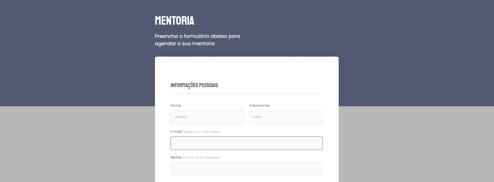
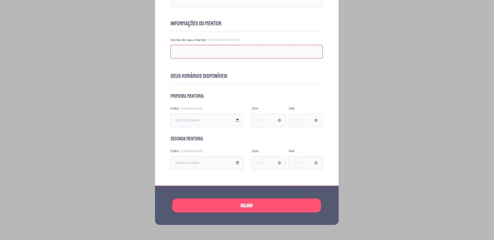

<h1 align="center"> Explorer (Stage 02) - Desafio Extra </h1>

Formação inicial no mercado de programação.   

  <a href="#-tecnologias">Tecnologias</a>&nbsp;&nbsp;&nbsp;|&nbsp;&nbsp;&nbsp;
  <a href="#-projeto">Projeto</a>&nbsp;&nbsp;&nbsp;|&nbsp;&nbsp;&nbsp;
  <a href="https://gabriel-adsv.github.io/stage03-projeto03-formulario-intermediario/" target="_blank">Layout</a>&nbsp;&nbsp;&nbsp;|&nbsp;&nbsp;&nbsp;
  <a href="#memo-licença">Licença</a>

  

 

  
  

## 🚀 Tecnologias
Esse projeto foi desenvolvido com as seguintes tecnologias:
- HTML e CSS
- Figma

## 💻 Projeto
O Desafio extra é uma página desktop com imagem, título, texto, rodapé e finaliza com um rodapé com efeito de onda. 
- [Acesse o projeto finalizado, online](https://gabriel-adsv.github.io/stage03-projeto03-formulario-intermediario/)

## 📝 Licença
Esse projeto está sob a licença MIT.

---
Feito com ♥ by Gabriel Augusto
